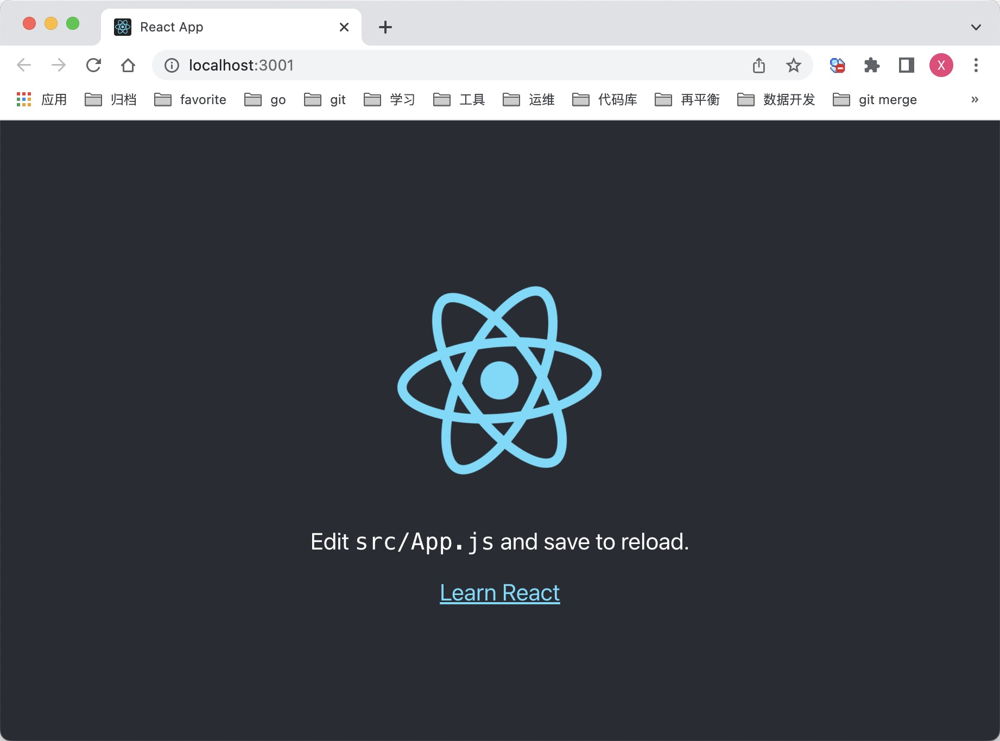
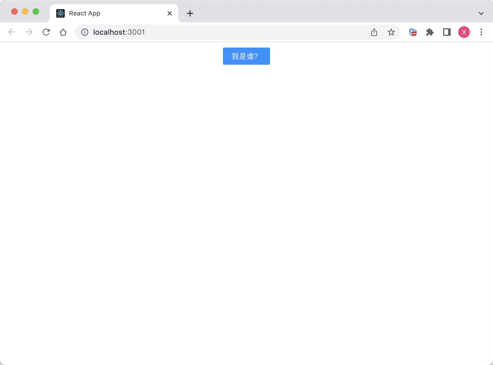

### 开始

#### 1. 安装 react 脚手架

```sh
# cnpm: npm install -g cnpm --registry=https://registry.npm.taobao.org
$ npm install -g create-react-app
```

#### 2. 创建 react 工程

```sh
$ create-react-app react-demo
```

#### 3. 启动工程

```sh
$ cd react-demo
$ npm start
```

运行效果


#### 4. 安装 ant-design

```sh
$ npm install antd --save
```

#### 5. 修改 src/App.js

```js
import React from "react";
import { Button, message } from "antd";
import "./App.css";

const info = () => {
  message.info("我是麻子");
};

const App = () => (
  <div className="App" style={{ padding: 10 }}>
    <Button type="primary" onClick={info}>
      我是谁？
    </Button>
  </div>
);

export default App;
```

#### 6. 修改 src/App.css

在文件顶部引入 css 文件：

```css
@import "~antd/dist/antd.css";
```

运行效果：

